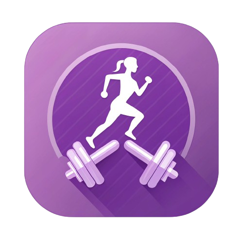

# Function Fit

<div align="center">
  
  <p><em>Your personal fitness companion for a stronger tomorrow</em></p>
  
  [](https://opensource.org/licenses/MIT)
  [](https://reactnative.dev/)
  [](https://expo.dev/)
  [](https://supabase.io/)
</div>

## 📱 Overview

Function Fit is a comprehensive mobile fitness application designed to help users track, plan, and achieve their fitness goals. Built with React Native and Expo, it offers a seamless cross-platform experience with an intuitive, modern interface that puts your fitness journey at your fingertips.

The app combines personalized workout planning, detailed progress tracking, and motivational elements to create an engaging fitness experience tailored to your needs. With secure authentication and data storage powered by Supabase, your fitness data is protected and accessible across all your devices.

## 🚀 Features

<div align="center">
  <table>
    <tr>
      <td align="center" width="33%">
        <h3>🏋️ Smart Workout Planning</h3>
        <p>Access customized workout plans tailored to your fitness level with detailed exercise instructions and progress tracking</p>
      </td>
      <td align="center" width="33%">
        <h3>📊 Progress Visualization</h3>
        <p>Track your fitness journey with comprehensive metrics and beautiful data visualizations of your improvement over time</p>
      </td>
      <td align="center" width="33%">
        <h3>📝 Workout Logging</h3>
        <p>Record and review your workout history with detailed metrics for sets, reps, weights, and performance analysis</p>
      </td>
    </tr>
    <tr>
      <td align="center" width="33%">
        <h3>🏆 Achievement System</h3>
        <p>Stay motivated with workout streaks, milestone celebrations, and unlockable achievements that reward consistency</p>
      </td>
      <td align="center" width="33%">
        <h3>🍎 Nutrition Tracking</h3>
        <p>Monitor your nutritional intake alongside your workouts for a holistic approach to fitness and health</p>
      </td>
      <td align="center" width="33%">
        <h3>📚 Exercise Library</h3>
        <p>Access a comprehensive library of exercises with proper form instructions and video demonstrations</p>
      </td>
    </tr>
  </table>
</div>

## 🛠️ Tech Stack

- **Frontend**:

  - React Native 0.76
  - Expo SDK 52
  - Expo Router for navigation
  - NativeWind (TailwindCSS) for styling
  - React Native Reanimated for animations

- **Backend**:

  - Supabase (PostgreSQL database)
  - Supabase Auth for user authentication
  - Supabase Storage for image storage

- **State Management**:

  - React Context API
  - Async Storage for local persistence

- **UI Components**:
  - Custom components with TailwindCSS
  - Expo Vector Icons
  - Expo Image
  - Expo Blur, Linear Gradient

## 📋 Prerequisites

Before you begin, ensure you have the following installed:

- [Node.js](https://nodejs.org/) (v18 or newer)
- [npm](https://www.npmjs.com/) or [Yarn](https://yarnpkg.com/)
- [Expo CLI](https://docs.expo.dev/get-started/installation/)
- [Supabase CLI](https://supabase.com/docs/guides/cli) (for backend development)

## 🔧 Installation

1. Clone the repository:

   ```bash
   git clone https://github.com/akosikhada/function-fit.git
   cd function-fit
   ```

2. Install dependencies:

   ```bash
   npm install
   # or
   yarn install
   ```

3. Set up your Supabase project:

   - Create a new project at [Supabase](https://app.supabase.com/)
   - Follow the instructions in `supabase-setup-instructions.md`
   - Configure your environment variables

4. Start the development server:
   ```bash
   npm start
   # or
   yarn start
   ```

## 📱 Usage

- **Sign Up/Login**: Create an account or sign in to access your personalized fitness journey
- **Plan**: Browse and select workout plans tailored to your goals
- **Workout**: Follow guided workouts with timer and exercise demonstrations
- **Progress**: Track your fitness metrics and visualize your improvement
- **Library**: Explore the exercise database with proper form instructions
- **Settings**: Customize your profile and app preferences

## 🚀 Deployment

### Expo Build

```bash
eas build --platform ios
eas build --platform android
```

### Publish Updates

```bash
eas update --branch production
```

## 📝 License

This project is licensed under the MIT License - see the [LICENSE](LICENSE) file for details.

---

<div align="center">

### Built with passion and expertise by

[](https://github.com/akosikhada)
[](https://github.com/znarf-y)

</div>
